# **SymStride: Project Outline**

## **1. Abstract**

SymStride enables full 3D running kinematics analysis using only low-cost IMUs, avoiding the controlled environments, privacy concerns,
and high costs of camera-based and optical motion-capture systems. IMUs placed on key body segments feed into fine-tuned ML models inspired by
DIP and MobilePoser to reconstruct full 3D pose, from which joint angles such as hip, knee, ankle, and elbow are computed through relative
rotations. Performance is evaluated by comparing these IMU-derived metrics against vision-based outputs from tools like Ochy, with success
defined by matching angle patterns and maintaining small numerical differences. The system already replicates the full IMU-to-mesh pipeline
using real data, with ongoing work focused on running-specific fine-tuning and jitter reduction.

## **2. Introduction**

### **2.1 Motivation**

The SymStride project aims to overcome the limitations of current running analysis methods, which rely heavily on cameras, controlled
lighting, and invasive setups. Video-based tools like Ochy and smartphone CV apps suffer from issues such as angle sensitivity,
occlusion, and privacy concerns, while high-accuracy optical motion capture remains prohibitively expensive and confined to indoor labs.
SymStride addresses these constraints by using low-cost, portable IMUs paired with machine learning models to provide accurate, camera-free
motion tracking. This IMU-only workflow enables coach-level running analysis for both novice and experienced runners without requiring any
changes to their normal routine.

### **2.2 State of the Art & Limitations**

Existing approaches to human pose reconstruction and running analysis fall into two categories: commercial methods and foundational
research, each with clear limitations that SymStride seeks to address. Commercial systems such as optical motion capture offer high accuracy
but are prohibitively expensive and restricted to controlled lab environments, while smartphone apps and tools like Ochy rely on
video-based computer vision that is sensitive to lighting, camera angle, and occlusion, and also raise privacy concerns and require deliberate
setup. Foundational research, including models such as DIP, MobilePoser, and IMUPoser, as well as datasets like AMASS and body models like SMPL,
demonstrates that IMU-driven full-body pose estimation is feasible but still requires fine-tuning to handle real-world running scenarios.
Collectively, these methods show promise but fall short of providing accessible, low-cost, camera-free, and routine-friendly running
analysis, gaps that SymStride's IMU-only workflow is designed to fill.

### **2.3 Novelty**

SymStride's core novelty is its fully IMU-only workflow, which eliminates the cameras, lighting dependencies, privacy concerns, and
controlled lab environments required by smartphone vision apps and optical motion-capture systems. Instead of relying on specialized
hardware, SymStride uses the IMUs already embedded in commercial consumer devices: phones, watches, and AirPods, and feeds their
signals into fine-tuned models such as DIP and MobilePoser to reconstruct full 3D human pose. From these reconstructions, SymStride
extracts key kinematic metrics like hip, knee, ankle, and elbow angles, enabling coach-level running analysis without any video capture or
marker-based setups. This makes high-quality running-form analysis accessible in everyday settings using devices people already own.

### **2.4 Challenges**

SymStride faces several challenges in converting sparse IMU data from consumer devices into accurate 3D running kinematics. A primary concern
is **accuracy and consistency**: the models must produce joint angles comparable to vision-based systems while handling variability across
different runners and movements. Running introduces significant **noise and jitter**, so the model does not generalize well to produce smooth,
kinematically plausible motion, particularly during fast, cyclical actions.

Additionally, **validation and ground truth** are critical. Even though the goal is a fully IMU-only workflow, the system must be rigorously
compared against synchronized video-based data, such as from Ochy, to confirm reliability. **Hardware integration and metric refinement** also
pose challenges, as SymStride must standardize data from multiple devices: iPhones, Apple Watches, and AirPods, while refining
calculations for advanced kinematic metrics, including symmetry and running-form subtleties. Overall, the project is
like reconstructing a full 3D landscape from scattered, noisy compass and accelerometer readings: portable and private, but requiring
sophisticated algorithms to produce precise and reliable insights.

### **2.5 Required Skills & Resources**

Successfully completing this project requires a combination of skills and hardware resources:

### **Skills**

- **Sensor Integration**: Proficiency in collecting and processing IMU
  sensor data.

- **HTTPS Protocols**: Understanding of how to stream data live from the
  iPhone to a laptop.

- **Machine Learning Integration**: Understanding of how to adapt prior
  machine learning models to our use case and run inference on custom
  data.

- **Web Dev**: Experience in designing and building the front and
  backend to a web app to display the results of our model in a clean
  and professional way.

- **Signal Processing/Data Analysis**: Understand data alignment and
  interpolation, processing the data appropriately to generate the
  insights we are interested in.

### **Hardware Resources**

- **iPhone, Apple Watch, AirPod**: A full Apple ecosystem and leveraging
  SensorLogger to transmit the data available across all devices.

### **2.6 Success Metrics**

The success of the SymStride project is measured by its ability to
derive running kinematic metrics and higher-level insights comparable to
those produced by established vision-based systems, such as Ochy, using
only Inertial Measurement Units (IMUs).

#### **Evaluation Goal and Approach**

Since Ochy is proprietary, intermediate results such as human poses
cannot be accessed or directly compared against; evaluation is therefore
limited to comparing SymStride's final outputs and derived insights.
Identical motion sequences are processed through the SymStride pipeline,
and the resulting metrics are directly compared to Ochy's outputs.

<table>
  <tr>
    <td align="center">
      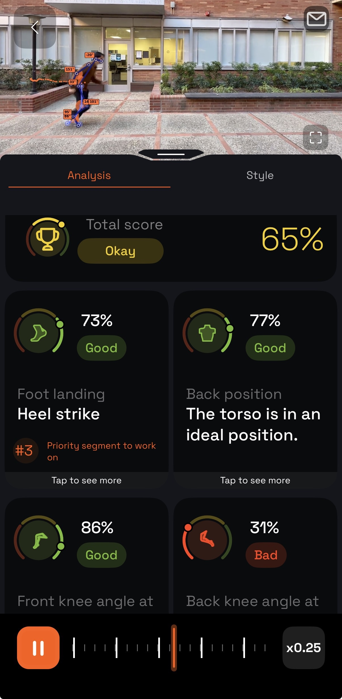
    </td>
    <td align="center">
      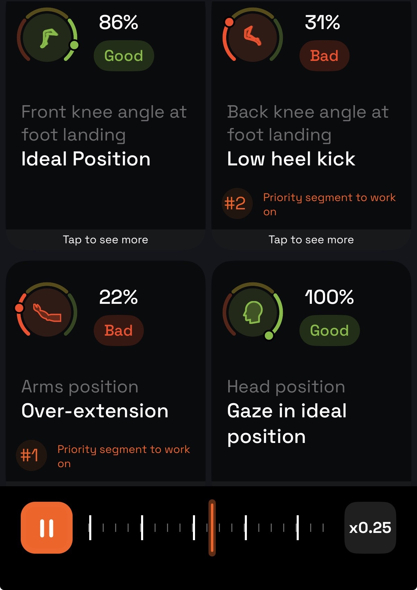
    </td>
  </tr>
</table>

<em>Figure 1: High Level Ochy Running Feedback</em>

#### **Key Accuracy and Consistency Metrics**

Evaluation focuses on minimizing discrepancies between SymStride outputs
and Ochy reference data:

1.  **Mean Absolute Error (MAE):** Quantifies differences between
    SymStride-derived metrics and Ochy outputs.

2.  **Standard Deviation of Error:** Measures the consistency of
    SymStride estimates across repeated movements.

3.  **Statistical Significance:** Assesses whether deviations from Ochy
    outputs are statistically meaningful.

#### **Performance and Output Parity Metrics**

SymStride's performance is further evaluated by comparing derived
outputs to high-level insights from Ochy, including knee angle and
symmetry, as well as running form characteristics such as knee and elbow
flexion, gaze, and foot landing patterns.

<table>
  <tr>
    <td align="center">
      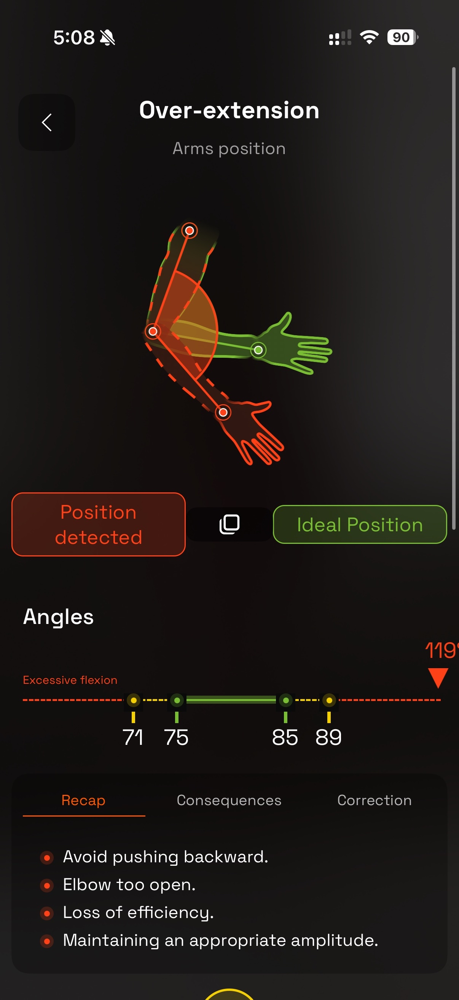
    </td>
    <td align="center">
      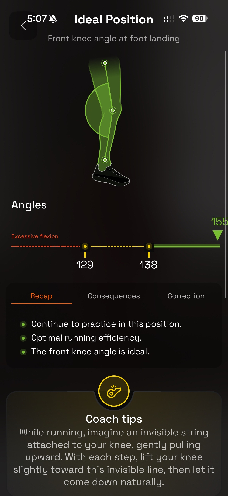
    </td>
  </tr>
</table>

<em>Figure 2: More detailed Ochy metrics such as arm and knee flexion and associated feedback</em>

#### **Success Criteria**

SymStride is considered successful when its outputs and insights closely
match Ochy, demonstrating the feasibility of an IMU-only approach for
coach-level running analysis.

## **3. Related Work**

The SymStride project builds upon both existing commercial running
analysis methods and foundational research in IMU-based human pose
reconstruction.

#### **Commercially Available Approaches**

Current commercial solutions illustrate the limitations that SymStride
seeks to address:

1.  **Optical Motion Capture:** Provides highly accurate measurements
    but is prohibitively expensive and requires controlled indoor
    laboratory environments.

2.  **Smartphone Applications (e.g., Ochy):** Estimate 2D or pseudo-3D
    poses from video using computer vision. Their accuracy is
    constrained by camera angle, lighting, occlusion, and the need for
    separate device setup. Additionally, video-based analysis raises
    privacy concerns. An example of one of our group members using Ochy can be viewed below.

<iframe width="560" height="315" src="https://www.youtube.com/embed/Uj1Aqu6_dM0?si=8dXzKbim4GB7ACEq" title="YouTube video player" frameborder="0" allow="accelerometer; autoplay; clipboard-write; encrypted-media; gyroscope; picture-in-picture; web-share" referrerpolicy="strict-origin-when-cross-origin" allowfullscreen></iframe>

#### **Foundational Research**

SymStride leverages and fine-tunes pre-existing machine learning models
and datasets to enable IMU-only pose reconstruction:

1.  **Deep Inertial Poser (DIP):** Uses sparse IMUs (six sensors) for
    real-time 3D pose reconstruction. SymStride incorporates DIP as a
    pre-trained model for pose extraction.

2.  **MobilePoser:** Enhances pose estimation via kinematic predictions,
    supporting real-time full-body pose reconstruction and 3D human
    translation from IMUs on mobile devices.

3.  **IMUPoser:** Focuses on full-body pose estimation using IMUs in
    consumer devices such as phones, watches, and headphones.

4.  **AMASS (Archive of Motion Capture as Surface Shapes):** A
    comprehensive motion capture dataset used for model training and
    evaluation.

5.  **SMPL (Skinned Multi-Person Linear Model):** Provides the human
    body mesh representation derived from the AMASS dataset.

The SymStride technical approach integrates these models and datasets
within a Python backend for inferencing, establishing a foundation for a
fully IMU-based running analysis workflow.

## **4. Technical Approach**

### **4.1 System Architecture**

SymStride implements a modular pipeline architecture consisting of three
primary stages: data acquisition, pose estimation, and symmetry
analysis. The data acquisition layer captures synchronized IMU streams
from heterogeneous Apple devices (iPhone, Apple Watch, AirPods) via the
SensorLogger iOS application, recording 6-DOF motion data (3-axis
acceleration and quaternion orientation) at native sampling rates. The
preprocessing module (process_own.py) performs temporal alignment using
UNIX epoch timestamps, applies spherical linear interpolation (SLERP)
for orientation data, and executes T-pose calibration to compute
sensor-to-body frame transformations. The pose estimation engine
leverages the MobilePoser neural network, a transformer-based model
trained on the AMASS dataset, which ingests the calibrated 6-sensor IMU
configuration to predict full-body SMPL pose parameters (72-dimensional
pose vector plus 3D root translation). Finally, the web-based dashboard
(built with React and Vite) consumes the pose predictions to compute
biomechanical metrics including joint angles, stride symmetry scores,
and gait asymmetries, presenting real-time visualizations and actionable
feedback through an interactive multi-view interface with
Recharts-powered analytics.

  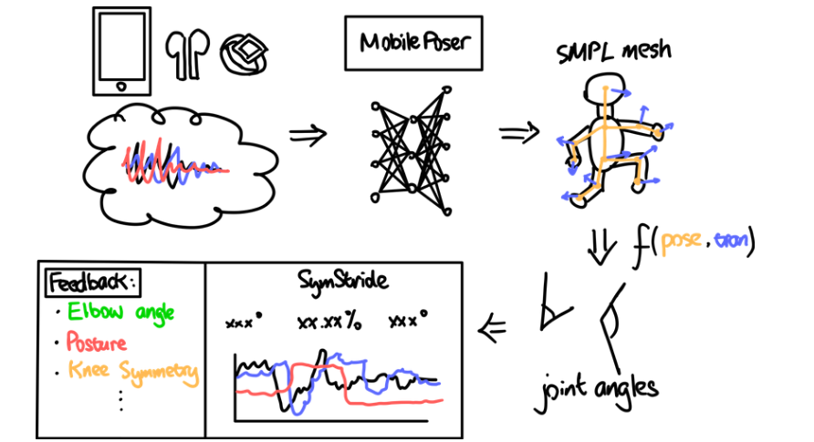
  
<em>Figure 3: System Design + Pipeline</em>

### **4.2 Data Preprocessing**

#### 4.21 Data Alignment and Interpolation

To synchronize IMU data from heterogeneous sensors (iPhone, Apple Watch,
AirPods), we implemented a temporal alignment pipeline that accounts for
the asynchronous nature of the hardware. Each sensor records data at
variable rates with UNIX epoch nanosecond timestamps provided by
SensorLogger. The align_all_sensors_to_common_timebase() function first
converts all timestamps to absolute seconds, then identifies the
overlapping time window across all active sensors. A uniform timeline is
generated at 100 Hz within this overlap region. Linear interpolation is
applied to the 3-axis acceleration data, while spherical linear
interpolation (SLERP) is used for the orientation quaternions to
preserve rotational continuity and avoid gimbal lock artifacts. This
produces synchronized sensor streams of equal length, which are
subsequently downsampled to the target 30 Hz frame rate required by the
MobilePoser model. This two-stage approach (alignment at 100 Hz, then
downsampling) ensures smooth interpolation while maintaining temporal
coherence across all input modalities.

#### 4.22 Device Calibration

​​The calibration process happens in two stages. First, the user aligns
their phone with their body\'s reference frame (x = Left, y = Up, z =
Forward), and the system captures IMU data for 3 seconds to compute a
smpl2imu rotation matrix that transforms from the phone\'s coordinate
system to the SMPL body model\'s coordinate system. Second, the user
stands in a T-pose with the phone in their right pocket while the system
captures another 3 seconds of data. This T-pose calibration computes two
offsets: device2bone, which accounts for how the phone is oriented
relative to the body\'s bone structure, and acc_offsets, which captures
the baseline acceleration readings. These calibration matrices are then
applied to all incoming IMU data during runtime to transform raw sensor
readings (quaternions and accelerations) into the global body frame that
the pose estimation model expects.

**4.3 SMPL Output Analysis**

After MobilePoser predicts the SMPL pose parameters (a 72-dimensional
axis-angle vector and a 3-D global translation), SymStride converts
these raw outputs into interpretable running-kinematic signals using the
SMPL model's forward kinematics (FK). The axis-angle parameters are
reshaped into 24 joint rotations and converted into 3×3 rotation
matrices. FK then applies these rotations through the SMPL skeleton
hierarchy: each joint's global transform is computed by multiplying its
parent's transform with its local rotation and rest-pose offset. This
produces a set of 24 global joint positions,
which serve as the geometric foundation for all downstream analysis.

  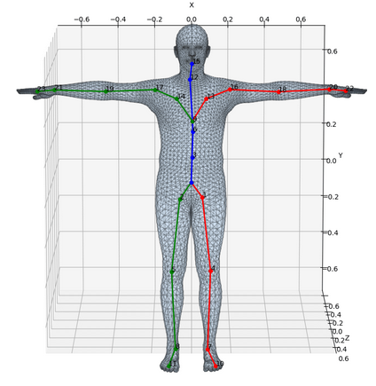

<em>Figure 4: SMPL Joint Indexes</em>

Joint angles are computed directly from 3D joint coordinates using
vector geometry. For a joint defined by points A-B-C (e.g.,
hip-knee-ankle), two vectors are formed,

  

normalized, and combined using a clamped dot product (clamped to range [-1,1] for arccos validity). The interior joint angle is then obtained as

  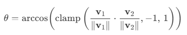

yielding stable frame-level angles in degrees. This formulation is
applied uniformly to knees (hip-knee-ankle) and elbows
(shoulder-elbow-wrist).

To enable gait-aware metrics, SymStride classifies the **front and back
legs** on a per-frame basis. When pelvis motion is available, the
direction of travel is estimated from consecutive pelvis positions and
each foot is projected onto this direction, the foot with the larger
projection is labeled as the front leg. In ambiguous cases,
classification falls back to knee extension, with the more extended knee
designated as the front leg.

Upper-body posture is characterized using head tilt and body lean. Head tilt is computed from the pelvis-to-head vector

  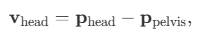

projected onto the sagittal (YZ) plane. The tilt angle relative to vertical is

  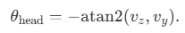

Body lean is approximated by the spine curvature angle:

  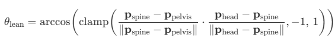

Although SymStride includes a foot-landing detector based on vertical
joint trajectories, velocity zero-crossings, and estimated ground
proximity, these signals are highly sensitive to pose jitter in the
IMU-only model. Consequently, landing events are unreliable, and this
work reports **global average kinematic metrics** over the entire
sequence rather than phase-specific values, leaving robust stride-phase
analysis for future work.

## **5. Evaluation & Results**

### **5.1 Model Performance**

We can only reliably validate the model performance visually against a
video of the output via SMPL viewer, since we do not have access to high
quality motion sequence capture devices. Upon visual inspection, the
general motions of the individual during data collection and model
training is observed, albeit with some artifacts in the extremities. For
example, when the individual walks or runs at an increased speed, the
output motion in the arms seems to be a little bit jittery and
unpredictable, but overall, the humanoid behaves as expected.

<video controls width="600">
  <source src="./media/smpl_output.mp4" type="video/mp4">
</video>
<em>Figure 5: Video of a sample SMPL viewer output</em>

### **5.2 Output Evaluation**

## SymStride Data

| Person  | Trial | Front Knee Angle (°) | Back Knee Angle (°) | Elbow Flexion (°) | Gaze (°) | Lean (°) |
|---------|-------|----------------------|---------------------|-------------------|----------|----------|
| Ido     | 1     | 141.9                | 148.2               | 119.2             | -0.7     | 8.2      |
| Ido     | 2     | 149.2                | 148.2               | 115.4             | -2.7     | 8.9      |
| Ido     | 3     | 148.3                | 150.4               | 130.5             | -2.2     | 9.5      |
| Michael | 1     | 147.0                | 143.4               | 112.5             | 3.4      | 7.4      |
| Michael | 2     | 138.5                | 140.7               | 128.4             | -1.6     | 11.4     |
| Michael | 3     | 137.6                | 137.7               | 121.3             | -0.2     | 9.4      |
| Yibo    | 1     | 145.2                | 147.8               | 125.8             | -4.2     | 8.6      |
| Yibo    | 2     | 146.9                | 149.8               | 126.4             | -1.8     | 7.2      |
| Yibo    | 3     | 147.6                | 149.8               | 129.8             | -0.2     | 8.8      |

## Ochy Data

| Person  | Trial | Front Knee Angle (°) | Back Knee Angle (°) | Elbow Flexion (°) | Gaze (°) | Lean (°) |
|---------|-------|----------------------|---------------------|-------------------|----------|----------|
| Ido     | 1     | 148                  | 103                 | 121               | -14      | 10       |
| Ido     | 2     | 164                  | 124                 | 150               | -10      | 0        |
| Ido     | 3     | 144                  | 103                 | 103               | -19      | 9        |
| Michael | 1     | 143                  | 114                 | 132               | -6       | 12       |
| Michael | 2     | 157                  | 123                 | 148               | -5       | 0        |
| Michael | 3     | 155                  | 118                 | 119               | -9       | 11       |
| Yibo    | 1     | 149                  | 120                 | 105               | 3        | 9        |
| Yibo    | 2     | 147                  | 123                 | 91                | 1        | 6        |
| Yibo    | 3     | 154                  | 113                 | 114               | -2       | 5        |

  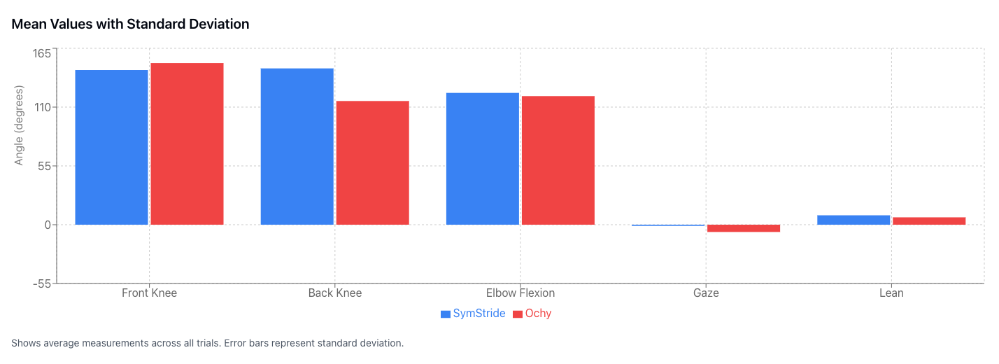

<em>Figure 6: Mean + SD Values</em>

  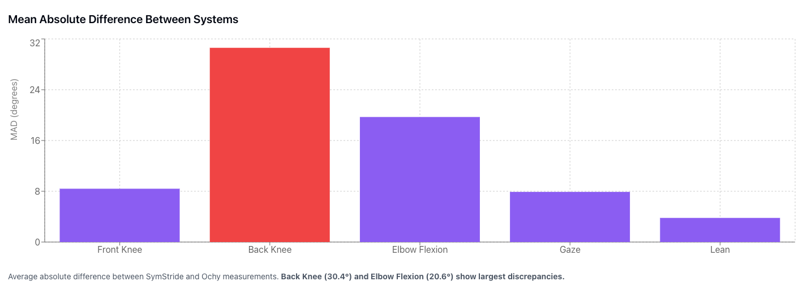

<em>Figure 7: MAD between Systems</em>

  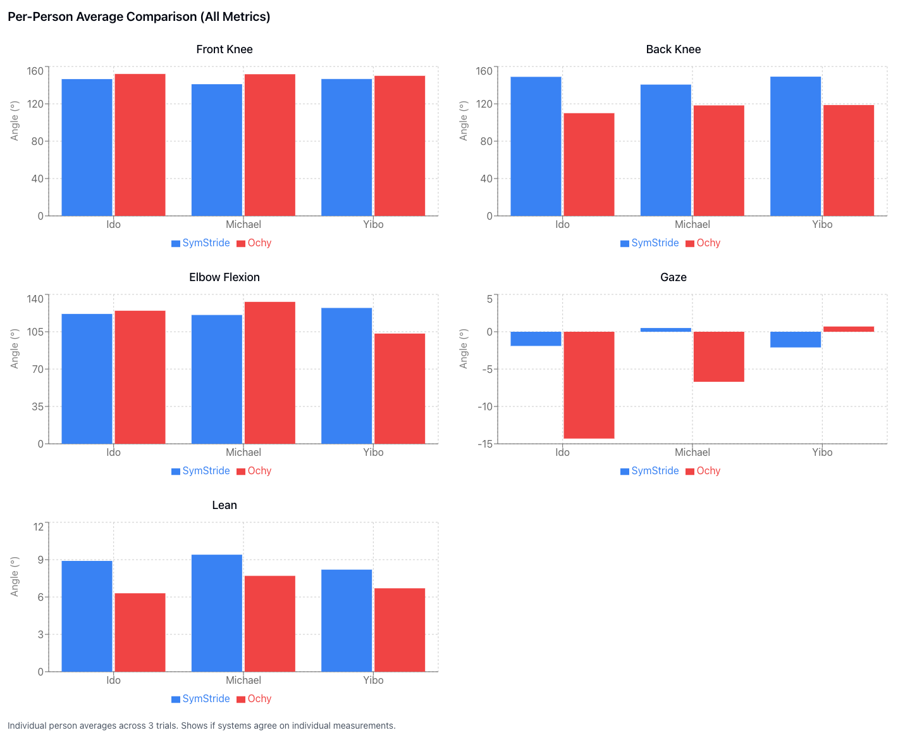

<em>Figure 8: Per-Person Average Comparisons for all Metrics</em>

  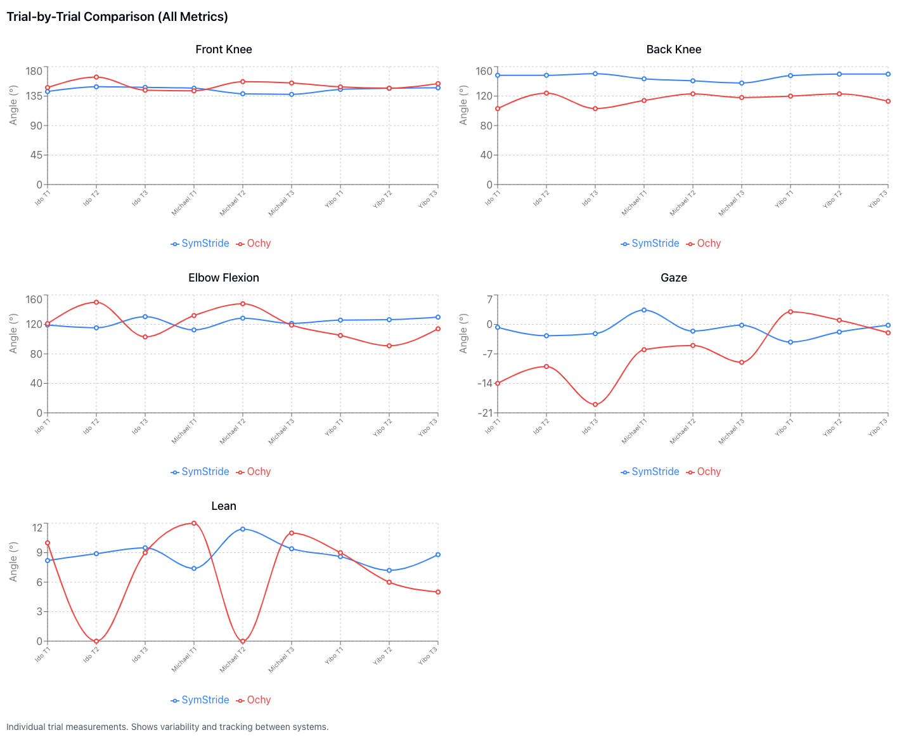

<em>Figure 9: Trial by Trial Comparisons for all Metrics</em>

  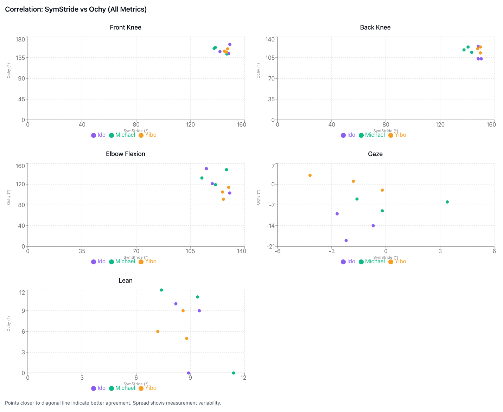

<em>Figure 10: SymStride vs Ochy Correlation</em>

### **5.3 Feedback Alignment Analysis**

To evaluate qualitative agreement with Ochy, SymStride metrics were mapped
to Ochy-style feedback categories using the same threshold ranges where possible.
Agreement was defined as both systems assigning the same qualitative label
(Good / Okay / Bad).

| Metric         | SymStride Mean±SD | Ochy Mean±SD | Mean Diff | MAD   | Feedback Agreement |
|----------------|------------------|-------------|-----------|-------|--------------------|
| Front Knee     | 144.7±4.3°        | 151.2±6.6°  | -6.5°     | 7.8°  | 88.9%              |
| Back Knee      | 146.2±4.3°        | 115.7±7.9°  | +30.6°   | 30.4° | 0%                 |
| Elbow Flexion  | 123.3±6.5°        | 120.3±20.0°| +2.9°     | 20.6° | 100%               |
| Gaze           | -1.1±1.9°         | -6.8±7.3°  | +5.7°     | 8.0°  | 22.2%              |
| Lean           | 8.8±1.3°          | 6.9±4.4°   | +1.9°     | 3.9°  | 66.7%              |

- **Front Knee Angle:** Strong alignment with Ochy, achieving **88.9% feedback agreement**. Despite a modest mean offset (−6.5°), SymStride consistently captures front-leg extension patterns, indicating reliable phase-aware knee estimation.

- **Back Knee Angle:** Systematic disagreement with **0% feedback agreement**. SymStride overestimates back-leg extension by a large margin (**+30.6° mean difference**, **30.4° MAD**), suggesting limitations in modeling trailing-leg dynamics with sparse IMU placement.

- **Elbow Flexion:** High feedback consistency (**100% agreement**) despite moderate numerical variability (**20.6° MAD**). This indicates that while absolute arm angles are noisy, SymStride reliably preserves qualitative arm-swing classification.

- **Gaze:** Low agreement (**22.2%**) with a noticeable mean bias (**+5.7°**). Although general head-orientation trends are captured, absolute gaze estimation remains sensitive to training bias and head–pelvis coupling in the IMU-only model.

- **Body Lean:** Moderate-to-strong agreement (**66.7%**) with a small mean offset (**+1.9°**) and low variability (**3.9° MAD**). Trunk orientation is robustly reconstructed, making body lean a reliable upper-body metric in SymStride.

## **6. Discussion & Conclusions**

### **6.1 Discussion**

### Finetuning

Major fine tuning of the model is needed for a more consistent and accurate output for our system. If we were given more time, we would finetune the model on a substantial set of data we collect ourselves to
specialize for running purposes. It would be of interest to train the model to observe more specific artifacts, such as high or low heel drive, directly as an output as opposed to generating an intermediary
layer to perform further data analysis on.

### Model Critiques

The MobilePoser model, and all parent models (IMUPoser, DIP, TransPose) in fact, are trained and evaluated on extremely limited data. There are a lot of overly-optimistic conclusions drawn that are heavily biased
towards the training data used. The models are only good for localized, steady movements that are performed while mostly standing upright. For example, motions are sorted into categories like walking in a circle or
waving hands. If the motions are substantially jerkier, quicker, or erratic, the model performs really poorly and generates a lot of artifacts. In addition, many conclusions drawn from recent papers are
largely skewed, such as AirPods do not contribute meaningfully to the accuracy of the model. Since almost all of the training data has the user's head stacked over the hip joint all of the time, the model
learned to generalize that the head is stacked above the hips usually. It is very reasonable to assume that if the user were to bend over to pick something up, headphones will contribute much more meaningfully in
detecting the human pose as described in the paper. Furthermore, by abstracting away the opposite matching sensors on the wrists and legs by having one phone and one watch, the best we can do is train the model to
mirror the motion onto the non-sensing side. For symmetrical movements, like running or walking, this is a sufficient assumption. However, for more complex tasks, these models would provide sub-par results.

### **6.2 Conclusion**

This work demonstrates the feasibility of performing coach-level running analysis using a fully IMU-only pipeline built on consumer devices. SymStride successfully reconstructs full-body 3D pose from sparse inertial data and derives meaningful kinematic metrics, such as knee angles, upper-body lean, and gaze direction, that qualitatively and numerically align with outputs from established vision-based tools like Ochy. These results suggest that camera-free running analysis is not only possible, but practical in everyday environments without controlled lighting, fixed camera placement, or privacy-invasive video capture.

At the same time, the evaluation highlights key limitations of current IMU-based pose models when applied to fast, cyclical, and high-impact motions such as running. While global kinematic trends are captured reliably, fine-grained temporal events (e.g., foot strike timing) and extremity motion remain sensitive to jitter and model bias introduced by limited and non-running-focused training data. These findings reinforce the need for task-specific fine-tuning and more diverse motion datasets, particularly for athletic movements that deviate from the slow, upright motions common in existing benchmarks.

Overall, SymStride establishes a strong foundation for accessible, low-cost, and privacy-preserving running analysis using devices users already own. With targeted fine-tuning on running-specific data, improved temporal smoothing, and more robust stride-phase detection, IMU-only systems like SymStride have the potential to close the remaining gap with vision-based approaches and enable scalable, real-world biomechanics analysis beyond the lab.

### **6.3 Demo**

<iframe width="560" height="315" src="https://www.youtube.com/embed/ps6nEUCEM1I?si=aOVZVJIjlMzR5jts" title="YouTube video player" frameborder="0" allow="accelerometer; autoplay; clipboard-write; encrypted-media; gyroscope; picture-in-picture; web-share" referrerpolicy="strict-origin-when-cross-origin" allowfullscreen></iframe>

## **7. References**

N. Mahmood, N. Ghorbani, N. F. Troje, G. Pons-Moll, and M. J. Black,
"AMASS: Archive of Motion Capture as Surface Shapes," in Proceedings of
the IEEE/CVF International Conference on Computer Vision (ICCV), Oct.
2019, pp. 5442-5451.\
\
M. Loper, N. Mahmood, J. Romero, G. Pons-Moll, and M. J. Black, "SMPL: A
skinned multi-person linear model," *ACM Transactions on Graphics*, vol.
34, no. 6, Art. no. 248, Oct. 2015.

X. Yi, Y. Zhou, and F. Xu, "TransPose: Real-time 3D human translation
and pose estimation with six inertial sensors," *ACM Transactions on
Graphics*, vol. 40, no. 4, Art. no. 86, Aug. 2021.

Y. Huang, M. Kaufmann, E. Aksan, M. J. Black, O. Hilliges, and G.
Pons-Moll, "Deep inertial poser: Learning to reconstruct human pose from
sparse inertial measurements in real time," *ACM Transactions on
Graphics*, vol. 37, no. 6, Art. no. 185, Nov. 2018.\
\
V. Mollyn, R. Arakawa, M. Goel, C. Harrison, and K. Ahuja, "IMUPoser:
Full-body pose estimation using IMUs in phones, watches, and earbuds,"
in *Proceedings of the 2023 CHI Conference on Human Factors in Computing
Systems (CHI '23)*, Hamburg, Germany, 2023, Art. no. 529, pp. 1-12.

V. Xu, C. Gao, H. Hoffmann, and K. Ahuja, "MobilePoser: Real-time
full-body pose estimation and 3D human translation from IMUs in mobile
consumer devices," in *Proceedings of the 37th Annual ACM Symposium on
User Interface Software and Technology (UIST)*, 2024, pp. 1-11.
